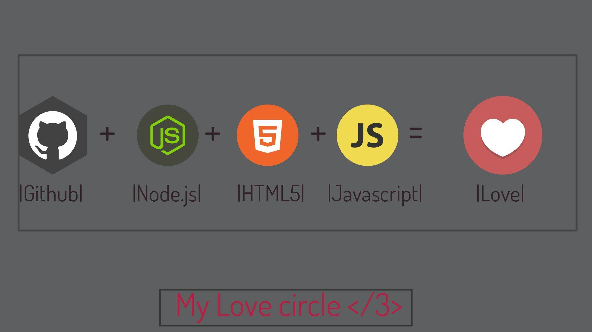

# JSLand
I started this repository to fill my gaps with JavaScript language. It all started as a *JavaScript 30 days challenge*, but as time went on I kept updating the repoistory with various kinds of technologies and decided to turn it into a library where anyone can learn something new. Read the full story on [Medium](https://medium.com/@mirza.ng4/back-to-square-one-javascript-41355ef3eda).

### Introducing *JSLand*, one of the best places to learn JavaScript! 

JSLand project is heavily focused on JavaScript language and covers topics like object oriented programming, major features of ES2015, ES2016, all the way to ES2019, asynchronous javascript, higher order functions, context, collections, immutability, but also Node.js, Express, MongoDB, Mocha, Lodash, Jquery, Webpack and React. 
There is also a section for various interesting modules like Moment, Bcrypt and many other.

In every lesson there is a __Useful links__ file where you'll find more detailed docs regarding the lesson,
as well as videos that will explain to you how things work. 
I'm also adding coding challenges and JavaScript interview questions which can be found in __Challenges__ directory.

### Contributions

This repository is public and __encourages__ forking with other users to contribute to open source by helping others learn
tough topics of JavaScript.
If you want to contribute, please do. JavaScript is a huge language and there is no way I can cover everything that is needed to be known. You can update the existing lessons or create a new ones. Every line of code you write makes an __impact__.

> But please, make sure you write clean and *error-free* code.

One last important thing to say is that lessons are **not** connected. 
There is **no** start script. If you see any scripts in *package.json* file, these are not connected to one project, but rather spread across multiple lessons and used where needed.

With that out of the way, I wish you happy coding and I hope you teach all of us something new. 

### Lessons: 
* Lesson 1 - **Core JavaScript:** JS DOM, JS OOP ES5/ES6, JS Storage
* Lesson 2 - **JavaScript Rules:** Hoisting, scopes, context, closures
* Lesson 3 - **Modern JavaScript:** ES6, ES7, ES8, ES9 and beyond (major features)
* Lesson 4 - **Collections:** Sets, Maps and Symbols
* Lesson 5 - **Higher order functions:** Array and string functions, for of/in loop, object methods
* Lesson 6 - **Jquery:** DOM traversal, jquery vs javascript, Todo: jquery UI, validate
* Lesson 7 - **Asynchronous Javascript:** Xhr, AJAX, Callbacks, Promises, Async Await and more
* Lesson 8 - **Build Tools:** Webpack, ESLint, Todo: Gulp
* Lesson 9 - **Regex**
* Lesson 10 - Todo: Design Patterns, algorithms and more
* Lesson 11 - Todo
* Lesson 12 - Todo
* Lesson 13 - Todo
* Lesson 14 - Todo: GraphQL
* Lesson 15 - Todo: Firebase
* Lesson 16 - **Node JS:** Core modules, data stream, require / export
* Lesson 17 - **Express JS:** Routing, middlewares, ejs template engine
* Lesson 18 - **Socket IO:** Chat App example 
* Lesson 19 - **MongoDB:** Crud operations, MongoDB operators, Todo: aggregation framework
* Lesson 20 - Todo: Mongoose
* Lesson 21 - **Create RESTAPI:** NodeJS with text files, Todo: NodeJS with MongoDB, NodeJS with PGSQL
* Lesson 22 - **Upload files:** NodeJS / Multer / Folder, Todo: NodeJS / MongoDB / Multer / GridFS
* Lesson 23 - Todo: Authentication: JWT, Passport JS
* Lesson 24 - **Lodash**
* Lesson 25 - Todo: Typescript 
* Lesson 26 - **Unit testing**: Mocha, Expect, Todo: Jest
* Lesson 27 - **ReactJS:** JSX, components, states, Todo: React Router
* Lesson 28 - Todo: Redux
* Lesson 29 - Todo: D3.js
* Lesson 30 - **Cool modules:** Validator, Chalk, Moment, Opn and more

The following is the list of people whose courses I watched and created previous lessons afterwards:
* [Andrew Mead](https://www.youtube.com/user/andrewjosephmead1/feed?disable_polymer=1)
* [Beau Carnes](https://www.youtube.com/channel/UC8butISFwT-Wl7EV0hUK0BQ)
* [Codedamn](https://www.youtube.com/channel/UCJUmE61LxhbhudzUugHL2wQ)
* [CodeWorkr](https://www.youtube.com/channel/UCfYTu_qAO5T7a-8rC_74Ypw)
* [Dcode](https://www.youtube.com/channel/UCjX0FtIZBBVD3YoCcxnDC4g)
* [Lasha Nozadze](https://www.udemy.com/the-ultimate-javascript-course-build-real-world-apps2018/)
* [LearnCode.academy](https://www.youtube.com/channel/UCVTlvUkGslCV_h-nSAId8Sw)
* [Maximilian Schwarzmüller](https://www.youtube.com/channel/UCSJbGtTlrDami-tDGPUV9-w)
* [Mike Dane](https://www.youtube.com/channel/UCvmINlrza7JHB1zkIOuXEbw)
* [O'Reilly](https://www.youtube.com/channel/UC3BGlwmI-Vk6PWyMt15dKGw)
* [Techsith](https://www.youtube.com/channel/UCbGZKLIHpox2l0whz6_RYyg)
* [The Coding Train](https://www.youtube.com/channel/UCvjgXvBlbQiydffZU7m1_aw)
* [The Net Ninja](https://www.youtube.com/channel/UCW5YeuERMmlnqo4oq8vwUpg)
* [The New Boston](https://www.youtube.com/channel/UCJbPGzawDH1njbqV-D5HqKw)
* [Traversy Media](https://www.youtube.com/user/TechGuyWeb)
* [Tyler McGinnis](https://www.youtube.com/channel/UCbAn7pVK2VIyo-UysfWGdZQ)
* [Wes Bos](https://www.youtube.com/channel/UCoebwHSTvwalADTJhps0emA)

Along with various other sources like [Medium](https://medium.com), [W3Schools](https://www.w3schools.com), [MDN](https://developer.mozilla.org) and other.
